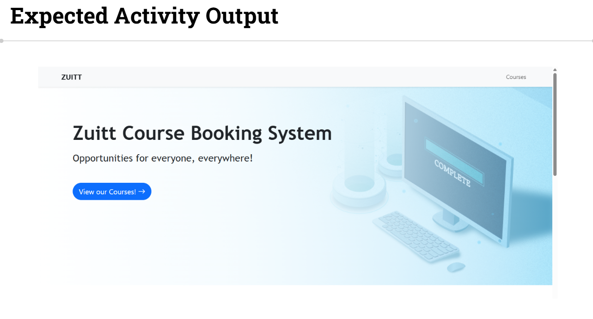
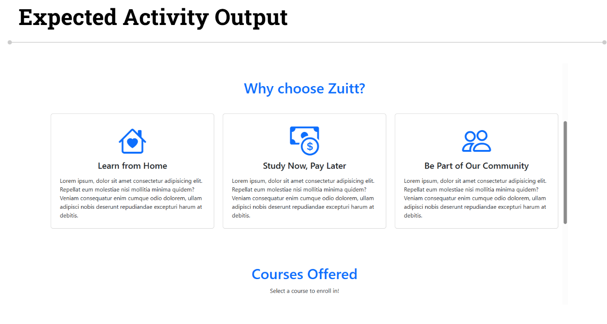
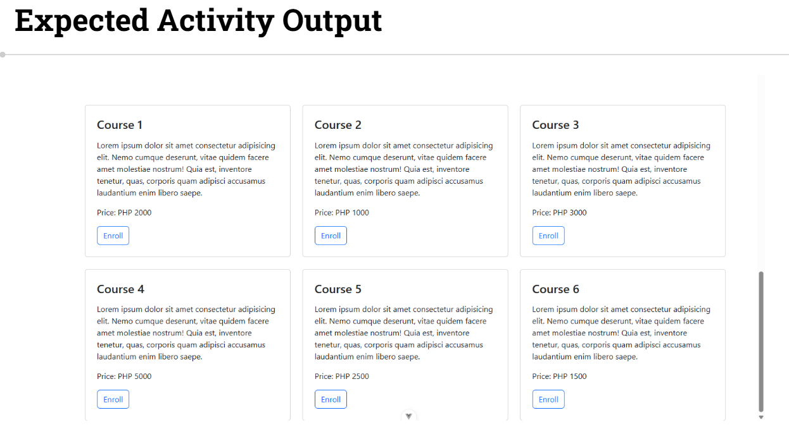

# Session 59 - VueJS - Booking App - Component-Driven Development


## Activity - 1 (Quiz)

[Quiz title](https://forms.gle/dPhHTe8u48iCoPzz8)

## Activity - 2

Create **new pages** and **components** to populate our application

#### Activity Instructions  


  


  


  

**Member 1:**

1. Update your **local groupwork git repo** and push with the commit message, "Add discussion s59"

2. **Modify** the **main.css** file to match your selected theme.
	- Update the h1 element with id **"banner-title"**
		- Change the font family to Trebuchet MS, sans-serif
		- Change the font weight to bolder
		- Change the font size to 54px
	- Update the p element with id **"motto"**
		- Change the font family to Trebuchet MS, sans-serif
		- Change the font-size to 1.7rem
	- Update the container with the id **"banner".**
		- https://i.imgur.com/frHbYvL.png
		- Add a linear gradient from right to left with the following values:
		- rgb(255, 255, 255), 70%, rgba(126, 209, 247, 0.5)
		- Add a background size cover
		- Add a background position center
		- Add a height of 550px
	- Google Fonts is not required.

3. Create a **"pages" folder** and add a new page component called **"HomePage".**
	- Import and render the "Banner" and "Highlights" component.
	- Render the Home page in the App component.


**Member 2:**

4. Create a new component called **"HighlightsComponent"**. Research the use of bootstrap component, card.
	- Add three bootstrap cards.
		- Add an id to each card as "highlight1", "highlight2", "highlight3".
		- Add titles the same as the given output.
		- Add your own description


**Member 3:**

5. Create a Course component with name as **"CourseComponent"**. Research the use of bootstrap component, card.
	- Add an id to the card as "CourseCard"
	- Add class of "h-100"
	- Add a title
	- Add a description
	- Add a price
	- Add a button
6. Create a Course component with name as **"CourseComponent2"**. Research the use of bootstrap component, card.
	- Add an id to the card as "CourseCard2"
	- Add class of "h-100"
	- Add a title
	- Add a description
	- Add a price
	- Add a button
7. Create a CourseCard component with name as **"CourseComponent3"**. Research the use of bootstrap component, card.
	- Add an id to the card as "CourseCard3"
	- Add class of "h-100"
	- Add a title
	- Add a description
	- Add a price
	- Add a button


**Member 4:**

8. Create a CourseCard component with name as **"CourseComponent4"**. Use and look up react-bootstrap, card.
	- Add an id to the card as "CourseCard4"
	- Add class of "h-100"
	- Add a title
	- Add a description
	- Add a price
	- Add a button
9. Create a CourseCard component with name as **"CourseComponent5"**. Use and look up react-bootstrap, card.
	- Add an id to the card as "CourseCard5"
	- Add class of "h-100"
	- Add a title
	- Add a description
	- Add a price
	- Add a button
10. Create a CourseCard component with name as **"CourseComponent6"**. Use and look up react-bootstrap, card.
	- Add an id to the card as "CourseCard6"
	- Add class of "h-100"
	- Add a title
	- Add a description
	- Add a price
	- Add a button


**Member 5:**

11. Add a new page component in the pages folder called **'CoursesPage'.**
	- Add a row and col and center its content.
		- Inside the col, add a centered h1 element with text, "Courses"
			- Add margins and paddings.
		- Inside the col, add a centered p element with text, "Select a course to enroll in!"
			- Add margins and paddings.
	- Add another row. Inside that row, add a div with class col-md-4 for each course card, and render your group member's course cards inside that div.
	- Render the Courses page in the App component.


**All Members:**

12. **Check out to your own git branch** with git checkout -b

13. Update your **local groupwork git repository** and push to git with the commit message of **Add activity code s59.**

14. Add the **groupwork** repo link in **Boodle for s59.**
---

## Activity Template  
```language
# Use the discussion code as the template.


```

---

### Activity References
- [Reference 1](https://getbootstrap.com/docs/5.0/components/card/#example)

