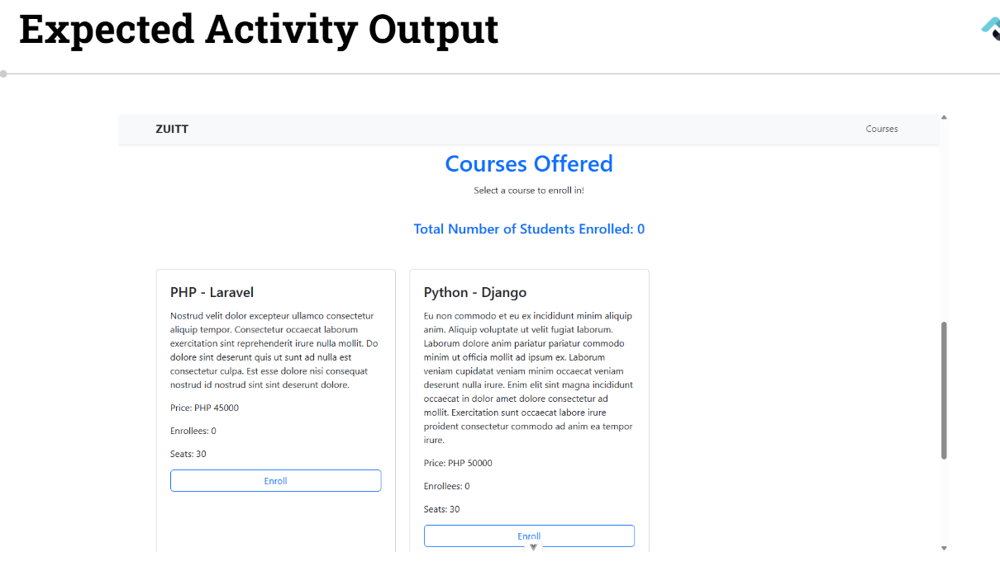
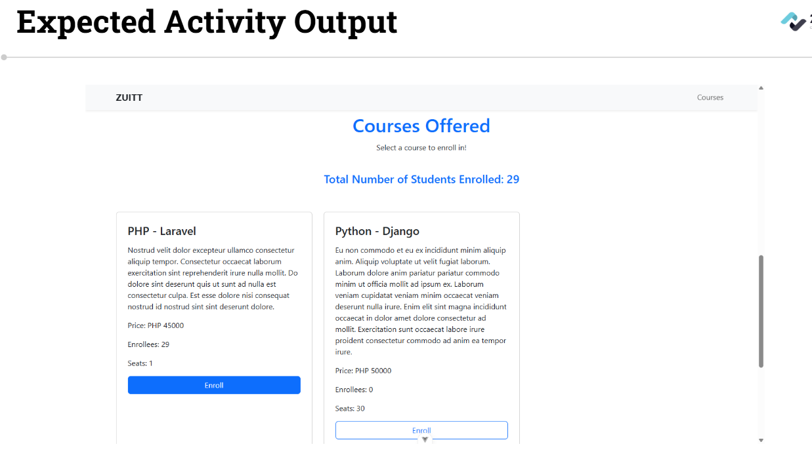
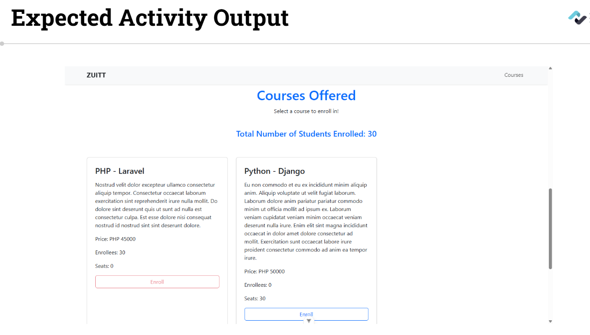
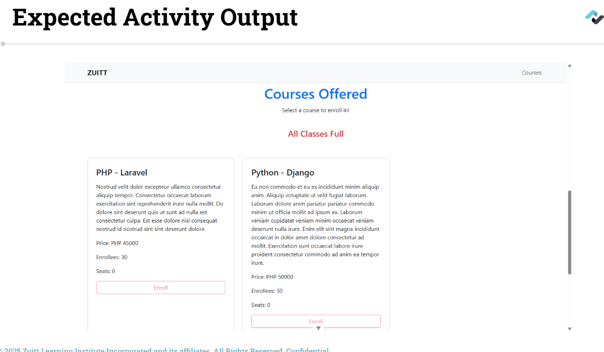
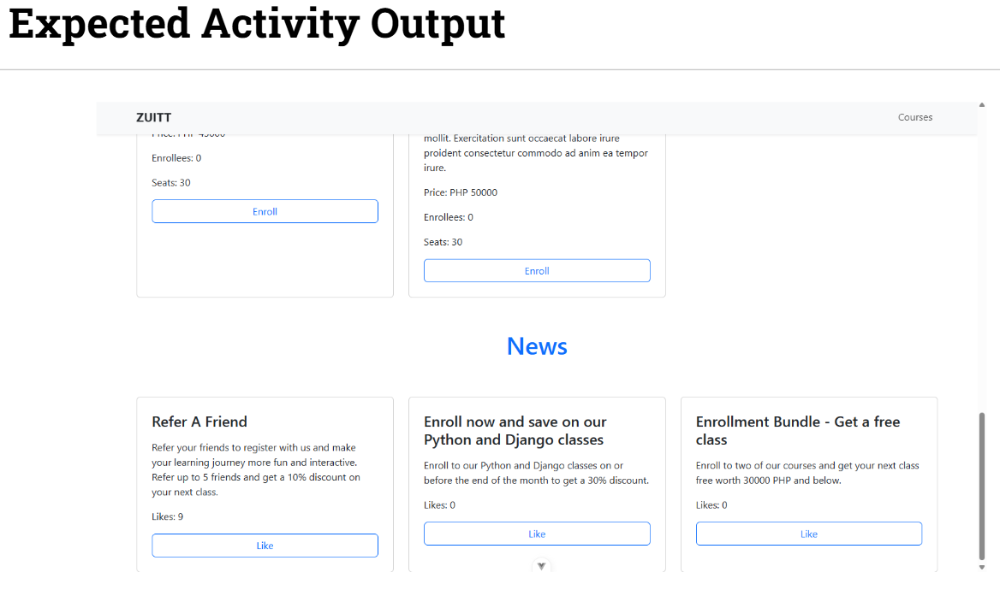
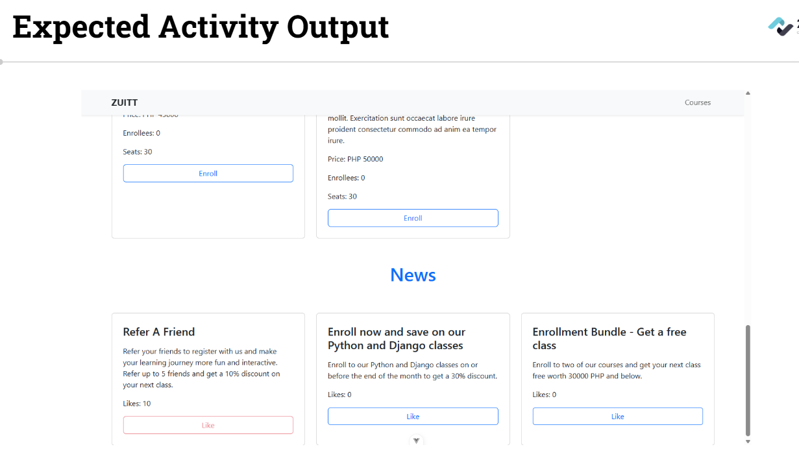

# Session 60 - VueJS - Options API, Components API, Props and Emits


## Activity - 1 (Quiz)


[Quiz title](https://forms.gle/VZfoWXw4tXgK8kR77)

## Activity - 2

**Conditionally** render **HTML elements** by using VueJS directives.

#### Activity Instructions  

**Member 1:**

1. Update your **local groupwork git repo** and push with the commit message, "Add discussion s60"

2. In the CourseComponent, Create a **"seats" reactive ref** that will **track** the number of seats available. The initial value of the seats reactive ref is 30. Then, update the enroll function that when it is run, the seats reactive ref will decrement. Return the seats reactive ref in the setup() method.

3. **Display** the seats reactive ref in the template block using **Double Moustaches.** Then, research the use of v-if and conditional rendering. If the seats state is equal to 0, show a disabled Enroll button. Else, show a usable button for enroll.

  
  
  

**Member 2:**

4. In the CoursesPage, add a **v-if directive** that will show an h4 with a short message, **"All Classes Full"**, if the value of total is equal to 60. Else, show an h4 element that **displays** the total number of enrollees

  

**Member 3:**

5. Create mock data for news with the following information:

	- news001
		- id: news001
		- name: Refer A Friend
		- description: Refer your friends to register with us and make your learning journey more fun and interactive. Refer up to 5 friends and get a 10% discount on your next class.
		- isActive: true
	- news002
		- id: news002
		- name: Enroll now and save on our Python and Django classes
		- description: Enroll to our Python and Django classes on or before the end of the month to get a 30% discount.
		- isActive: true
	- news003
		- id: news003
		- name: Enrollment Bundle - Get a free class
		- description: Enroll to two of our courses and get your next class free worth 30000 PHP and below.
		- isActive: true

6. Create a "News" component that will display the name, the description, number of likes and a button with the text "Like".
 


**Member 4:**

7. In the NewsComponent, Create a "like" reactive ref that will track the number of likes. The initial value of the seats reactive ref is 0. Then, create the likeNews function that when it is run, the likes reactive ref will increment. Return the likes reactive ref in the setup() method.

8. Display the **likes** reactive ref in the template block using Double Moustaches. Then, research the use of v-if and conditional rendering. If the likes state is equal to 10, show a disabled Like button. Else, show a usable button for Like.



**Member 5:**

9. Create a "News" page that will display the contents of the "newsData" to create multiple "News" components.

10. Import and render the "News" page in the "App" component to display the newly created page.


**All members:**

11. **Check out to your own git branch** with git checkout -b

12. Update your **local groupwork git repository** and push to git with the commit message of **Add activity code s60.**

13. Add the **groupwork** repo link in **Boodle for s60.**

---

## Activity Template  
```language
# Use discussion codes as template.


```

---

### Activity References
- [Reference 1](https://vuejs.org/guide/essentials/conditional.html#v-if)

