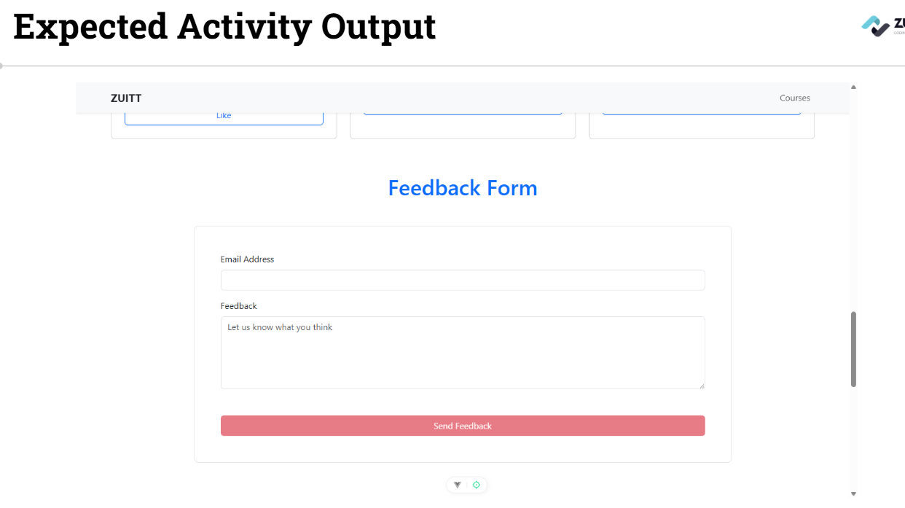
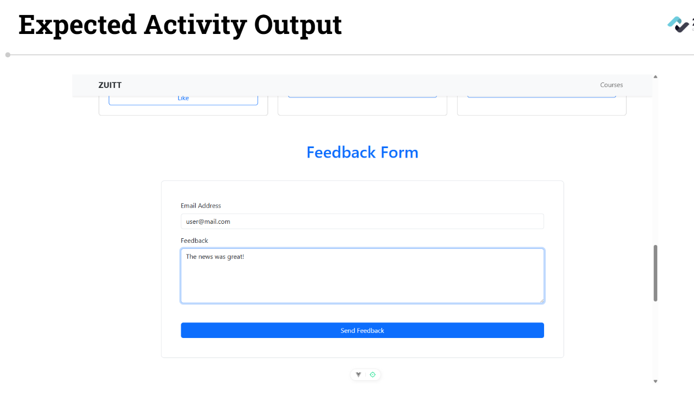
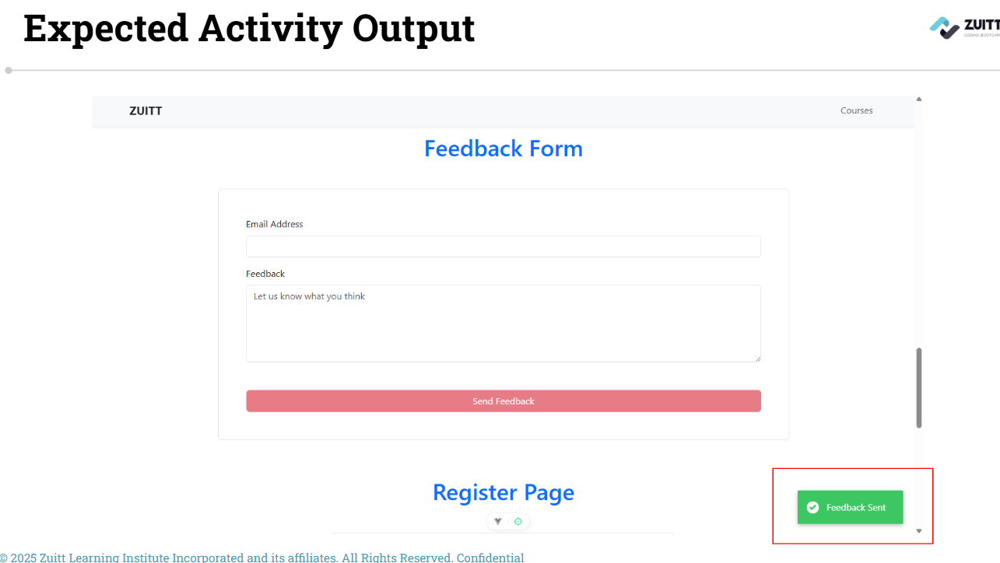
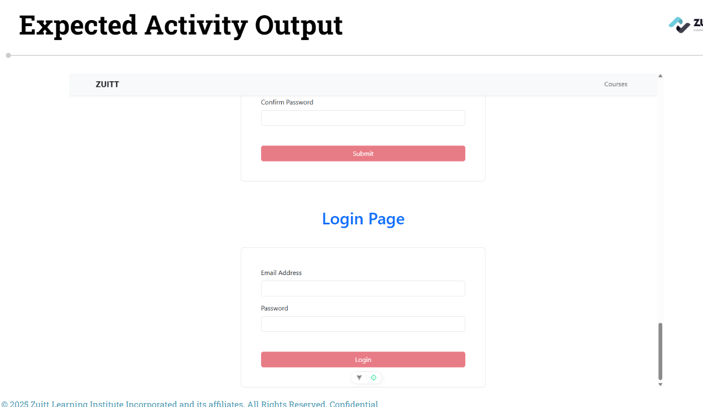
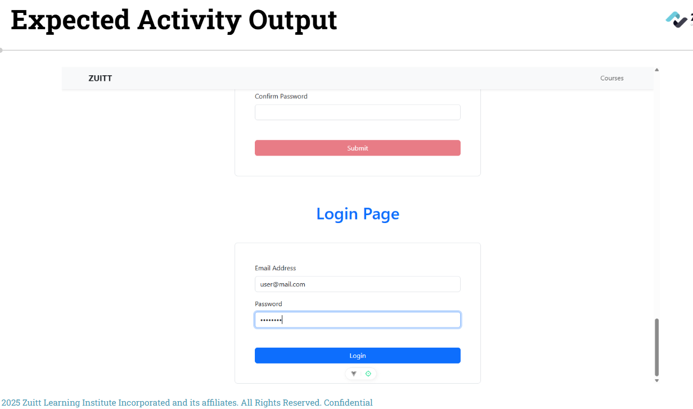
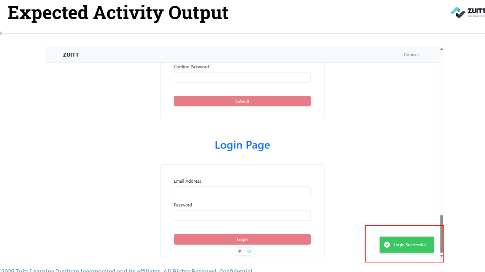
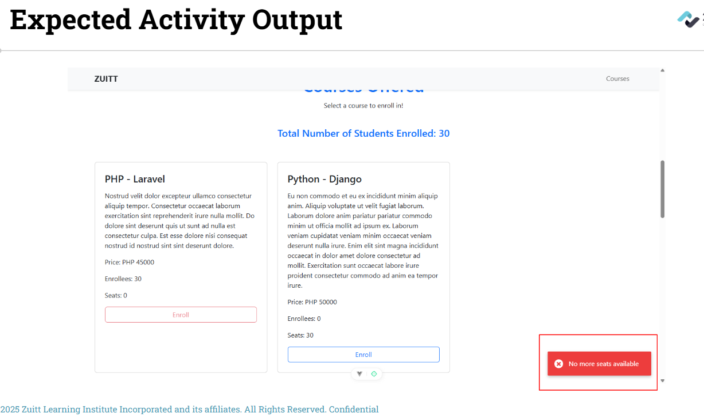

# Session 61 - VueJS - Attribute & Form bindings, Event Listeners and Watchers


## Activity - 1 (Quiz)

[VueJS Quiz 3](https://forms.gle/F6u7yZDTfDp9Vw2q9)

## Activity - 2

**Simulate a user login** and **authentication** by creating a Login page.

#### Activity Instructions  

**Member 1:**

1. Update your **local groupwork git repo** and push with the commit message, "Add discussion s61"

2. Create a feedback form in the "News" page which contains a form with its input elements bound to their respective reactive input states.

3. Create reactive states for each input to bind to as well as a reactive state for conditional rendering. Then, create a watch() hook which will check if the inputs are empty. If they are, disable the submit button using v-if, else, enable the button.


  
  


**Member 2:**

4. Add a submit event as well as a handler function which will display the current values of the input states upon submission. Then, add a notyf which will show a message to the user upon successful submission of their feedback. Make sure to clear the values after submission.
 


**Member 3:**

5. Create a new LoginPage component which contains a form with its input elements bound to their respective reactive input states.

6. Create reactive states for each input to bind to as well as a reactive state for conditional rendering. Then, create a watch() hook which will check if the inputs are empty. If they are, disable the submit button using v-if, else, enable the button.

 
 


**Member 4:**

7. Add a submit event as well as a handler function which will display the current values of the input states upon submission. Then, add a notyf which will show a message to the user upon logging in. Make sure to clear the values after submission.

8. Add a span under each login inputs which displays a short requirement message when the input state is found empty. The span should disappear once data is input.

 


**Member 5:**

9. Import and render the "Login" page in the "App" component.

10. Update the "CourseComponent", add a notyf which will show a message to the user once the seats reach 0.
 


**All Members:**

11. **Check out to your own git branch** with git checkout -b

12. Update your **local groupwork git repository** and push to git with the commit message of **Add activity code s61.**

13. Add the **groupwork** repo link in **Boodle for s61.**


---

## Activity Template  
```language
# Use discussion codes as template.
```

---

### Activity References
- [Watchers](https://vuejs.org/guide/essentials/watchers.html)
- [Form Input Bindings](https://vuejs.org/guide/essentials/forms.html#form-input-bindings)
- [Attribute Bindings](https://vuejs.org/guide/essentials/template-syntax.html#attribute-bindings)
- [v-bind directive](https://vuejs.org/api/built-in-directives.html#v-bind)
- [v-model directive](https://vuejs.org/guide/components/v-model.html#component-v-model)
- [Notyf](https://carlosroso.com/notyf/)

