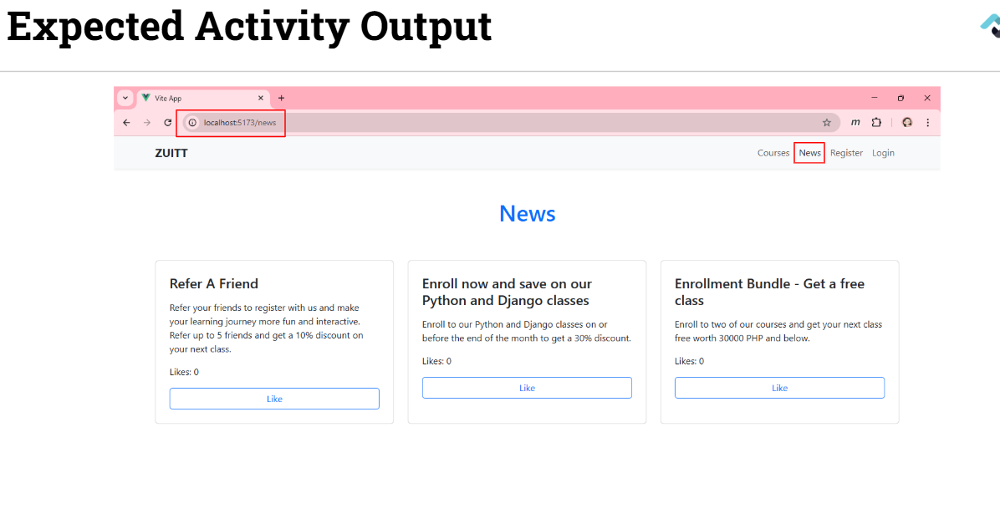
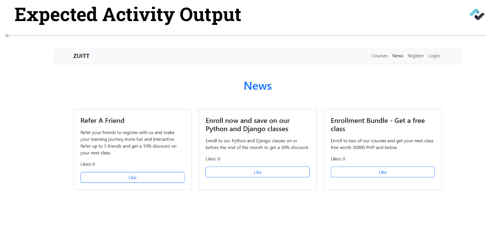
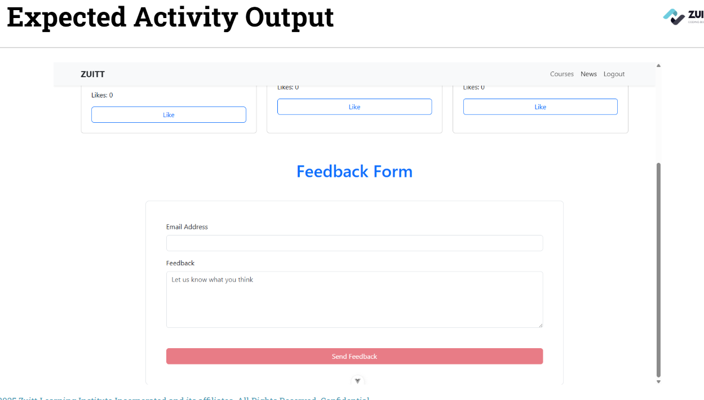
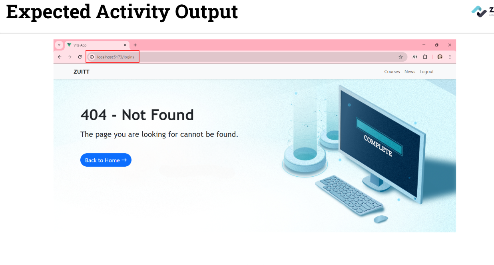

# Session 62 - VueJS - Routing and Conditional Rendering

## Activity - 1 (Quiz)

[VueJS Quiz 4](https://forms.gle/7goZXWUWePLxJcDq6)

## Activity - 2

**Create an Error Page** which will display when the user navigates to an **undefined route** within our app.

#### Activity Instructions  

**Member 1:**

1. Update your local groupwork git repo and push with the commit message, "Add discussion s62"

2. Create a route for the news page using the url "/news"
 

**Member 2:**

3. Modify the "Navbar" component to include a link to the "NewsPage" component.

4. Modify the "News" page to add v-if directives to conditionally render the feedback form based on the email state that when a user is not logged in, the form must not appear.

 
 
 

**Member 3:**

5. Create an "ErrorPage" that will display a BannerComponent. Pass a bannerProp to dynamically change the title, tagline, destinaation, and button label to the the given messages. You can use setup() method or script setup.
	
	- title: "404 - Not Found",
	- tagline: "The page you are looking for cannot be found.",
	- destination: "Home",
	- buttonLabel: "Back to Home"

6. Add the ErrorPage in the the routes. The error page must be displayed when a url endpoint is navigated to but is not defined in our routes.



**Member 4:**

7. Modify the "HomePage" component that will display a BannerComponent. Pass additional bannerProp to dynamically change the destination and button label to the the given messages.

	- title: "Zuitt Course Booking System",
	- tagline: "Opportunities for everyone, everywhere",
	- destination: "Courses",
	- buttonLabel: "View Our Courses"


**Member 5:**

8. Update the "Banner" component to contain a dynamic button that changes based on the bannerProp data and routes to the appropriate page when clicked.


**All Members:**

9. **Check out to your own git branch** with git checkout -b

10. Update your **local groupwork git repository** and push to git with the commit message of **Add activity code s62.**

11. Add the **groupwork** repo link in **Boodle for s62.**


---

## Activity Template  
```language
# Use discussion codes as template.


```

---

### Activity References
- [Vue Router](https://router.vuejs.org/guide/#An-example)
- [Lifecycle Hooks - onBeforeMount()](https://vuejs.org/api/composition-api-lifecycle.html#onbeforemount)
- [localStorage property](https://developer.mozilla.org/en-US/docs/Web/API/Window/localStorage)

